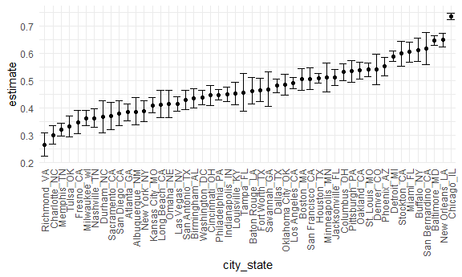
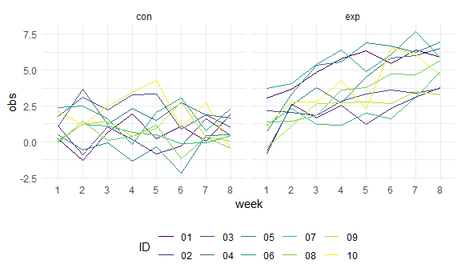

Homework 5
================
Nancy Fang (nf2466)

## Problem 1

Read in the data

``` r
homicide_df = 
  read_csv("data/homicide-data.csv")%>%
  mutate(
    city_state = str_c(city, state, sep="_"),
    resolved = case_when(disposition == "Closed by arrest" ~"solved",
                         disposition == "Closed without arrest" ~"unsolved",
                         disposition == "Open/No arrest" ~"unsolved"))%>%
  select(city_state, resolved)
```

    ## Parsed with column specification:
    ## cols(
    ##   uid = col_character(),
    ##   reported_date = col_double(),
    ##   victim_last = col_character(),
    ##   victim_first = col_character(),
    ##   victim_race = col_character(),
    ##   victim_age = col_character(),
    ##   victim_sex = col_character(),
    ##   city = col_character(),
    ##   state = col_character(),
    ##   lat = col_double(),
    ##   lon = col_double(),
    ##   disposition = col_character()
    ## )

The raw data is a CSV file that contains several variables, including
the report date, first and last name of the victims, race, age, sex,
city, state, location (latitude and longitude) and disposition of the
case. The original dataset contains 52179 rows.

Aggregate data:

``` r
homicide_sum = 
  homicide_df %>%
    group_by(city_state)%>%
  summarize(
    hom_total = n(),
    hom_unsolved = sum(resolved == "unsolved")
  )%>%
  filter(city_state != "Tulsa_AL")
```

    ## `summarise()` ungrouping output (override with `.groups` argument)

We know that there are only 50 cities included in the data set, yet the
original dataset had 51 cities. When we arranged the `city_state`
variable by total homicides, we saw that Tulsa\_AL only had one total
homicide, which likely was an input error.

Single prop test for Baltimore, MD:

``` r
  baltimore_prop = 
  prop.test(homicide_sum %>% filter(city_state == "Baltimore_MD") %>% pull(hom_unsolved),
            homicide_sum %>% filter(city_state == "Baltimore_MD") %>% pull(hom_total)
  ) %>% 
  broom::tidy() %>%
  select(estimate, conf.low, conf.high)
```

Prop.test for each of the cities in your dataset:

``` r
results_df = 
  homicide_sum %>%
  mutate(
    prop_tests = map2(.x = hom_unsolved, .y = hom_total, ~prop.test(x = .x, n = .y)),
    tidy_tests = map(.x = prop_tests, ~broom::tidy(.x))
  )%>%
  select(-prop_tests)%>%
  unnest(tidy_tests)%>%
  select(city_state,estimate, conf.low, conf.high)

results_df %>%
  knitr::kable()
```

| city\_state        |  estimate |  conf.low | conf.high |
| :----------------- | --------: | --------: | --------: |
| Albuquerque\_NM    | 0.3862434 | 0.3372604 | 0.4375766 |
| Atlanta\_GA        | 0.3833505 | 0.3528119 | 0.4148219 |
| Baltimore\_MD      | 0.6455607 | 0.6275625 | 0.6631599 |
| Baton Rouge\_LA    | 0.4622642 | 0.4141987 | 0.5110240 |
| Birmingham\_AL     | 0.4337500 | 0.3991889 | 0.4689557 |
| Boston\_MA         | 0.5048860 | 0.4646219 | 0.5450881 |
| Buffalo\_NY        | 0.6122841 | 0.5687990 | 0.6540879 |
| Charlotte\_NC      | 0.2998544 | 0.2660820 | 0.3358999 |
| Chicago\_IL        | 0.7358627 | 0.7239959 | 0.7473998 |
| Cincinnati\_OH     | 0.4452450 | 0.4079606 | 0.4831439 |
| Columbus\_OH       | 0.5304428 | 0.5002167 | 0.5604506 |
| Dallas\_TX         | 0.4811742 | 0.4561942 | 0.5062475 |
| Denver\_CO         | 0.5416667 | 0.4846098 | 0.5976807 |
| Detroit\_MI        | 0.5883287 | 0.5687903 | 0.6075953 |
| Durham\_NC         | 0.3659420 | 0.3095874 | 0.4260936 |
| Fort Worth\_TX     | 0.4644809 | 0.4222542 | 0.5072119 |
| Fresno\_CA         | 0.3470226 | 0.3051013 | 0.3913963 |
| Houston\_TX        | 0.5074779 | 0.4892447 | 0.5256914 |
| Indianapolis\_IN   | 0.4493192 | 0.4223156 | 0.4766207 |
| Jacksonville\_FL   | 0.5111301 | 0.4820460 | 0.5401402 |
| Kansas City\_MO    | 0.4084034 | 0.3803996 | 0.4370054 |
| Las Vegas\_NV      | 0.4141926 | 0.3881284 | 0.4407395 |
| Long Beach\_CA     | 0.4126984 | 0.3629026 | 0.4642973 |
| Los Angeles\_CA    | 0.4900310 | 0.4692208 | 0.5108754 |
| Louisville\_KY     | 0.4531250 | 0.4120609 | 0.4948235 |
| Memphis\_TN        | 0.3190225 | 0.2957047 | 0.3432691 |
| Miami\_FL          | 0.6048387 | 0.5685783 | 0.6400015 |
| Milwaukee\_wI      | 0.3614350 | 0.3333172 | 0.3905194 |
| Minneapolis\_MN    | 0.5109290 | 0.4585150 | 0.5631099 |
| Nashville\_TN      | 0.3624511 | 0.3285592 | 0.3977401 |
| New Orleans\_LA    | 0.6485356 | 0.6231048 | 0.6731615 |
| New York\_NY       | 0.3875598 | 0.3494421 | 0.4270755 |
| Oakland\_CA        | 0.5364308 | 0.5040588 | 0.5685037 |
| Oklahoma City\_OK  | 0.4851190 | 0.4467861 | 0.5236245 |
| Omaha\_NE          | 0.4132029 | 0.3653146 | 0.4627477 |
| Philadelphia\_PA   | 0.4478103 | 0.4300380 | 0.4657157 |
| Phoenix\_AZ        | 0.5514223 | 0.5184825 | 0.5839244 |
| Pittsburgh\_PA     | 0.5340729 | 0.4942706 | 0.5734545 |
| Richmond\_VA       | 0.2634033 | 0.2228571 | 0.3082658 |
| Sacramento\_CA     | 0.3696809 | 0.3211559 | 0.4209131 |
| San Antonio\_TX    | 0.4285714 | 0.3947772 | 0.4630331 |
| San Bernardino\_CA | 0.6181818 | 0.5576628 | 0.6753422 |
| San Diego\_CA      | 0.3796095 | 0.3354259 | 0.4258315 |
| San Francisco\_CA  | 0.5067873 | 0.4680516 | 0.5454433 |
| Savannah\_GA       | 0.4674797 | 0.4041252 | 0.5318665 |
| St. Louis\_MO      | 0.5396541 | 0.5154369 | 0.5636879 |
| Stockton\_CA       | 0.5990991 | 0.5517145 | 0.6447418 |
| Tampa\_FL          | 0.4567308 | 0.3881009 | 0.5269851 |
| Tulsa\_OK          | 0.3310463 | 0.2932349 | 0.3711192 |
| Washington\_DC     | 0.4379182 | 0.4112495 | 0.4649455 |

Plot that shows the estimates and CIs for each city:

``` r
unsolved_plot = 
  results_df %>%
  mutate(city_state = fct_reorder(city_state,estimate)) %>%
  ggplot(aes(x = city_state, y = estimate)) +
    geom_point() +
    geom_errorbar(aes(ymin = conf.low, ymax = conf.high)) +
    theme(axis.text.x = element_text(angle = 90, vjust = 0.5, hjust = 1))

unsolved_plot
```



## Problem 2

Create a tidy dataframe containing data from all participants, including
the subject ID, arm, and observations over time:

Read in data:

``` r
path_df = 
  tibble(
  path = list.files("data/problem_2/data")) %>%
  mutate(
    path = str_c("data/problem_2/data", path, sep = "/"),
    data = map(.x = path, ~read_csv(.x))
  )%>%
  unnest(data)%>%
  mutate(
    path = str_replace(path,"data/problem_2/data/",""),
    path = str_remove(path, ".csv")
  )%>%
  separate(path, c("arm", "ID"))%>%
  pivot_longer(cols = starts_with("week"),
               names_to = "week",
               names_prefix = "week_",
               values_to = "obs")
```

    ## Parsed with column specification:
    ## cols(
    ##   week_1 = col_double(),
    ##   week_2 = col_double(),
    ##   week_3 = col_double(),
    ##   week_4 = col_double(),
    ##   week_5 = col_double(),
    ##   week_6 = col_double(),
    ##   week_7 = col_double(),
    ##   week_8 = col_double()
    ## )
    ## Parsed with column specification:
    ## cols(
    ##   week_1 = col_double(),
    ##   week_2 = col_double(),
    ##   week_3 = col_double(),
    ##   week_4 = col_double(),
    ##   week_5 = col_double(),
    ##   week_6 = col_double(),
    ##   week_7 = col_double(),
    ##   week_8 = col_double()
    ## )
    ## Parsed with column specification:
    ## cols(
    ##   week_1 = col_double(),
    ##   week_2 = col_double(),
    ##   week_3 = col_double(),
    ##   week_4 = col_double(),
    ##   week_5 = col_double(),
    ##   week_6 = col_double(),
    ##   week_7 = col_double(),
    ##   week_8 = col_double()
    ## )
    ## Parsed with column specification:
    ## cols(
    ##   week_1 = col_double(),
    ##   week_2 = col_double(),
    ##   week_3 = col_double(),
    ##   week_4 = col_double(),
    ##   week_5 = col_double(),
    ##   week_6 = col_double(),
    ##   week_7 = col_double(),
    ##   week_8 = col_double()
    ## )
    ## Parsed with column specification:
    ## cols(
    ##   week_1 = col_double(),
    ##   week_2 = col_double(),
    ##   week_3 = col_double(),
    ##   week_4 = col_double(),
    ##   week_5 = col_double(),
    ##   week_6 = col_double(),
    ##   week_7 = col_double(),
    ##   week_8 = col_double()
    ## )
    ## Parsed with column specification:
    ## cols(
    ##   week_1 = col_double(),
    ##   week_2 = col_double(),
    ##   week_3 = col_double(),
    ##   week_4 = col_double(),
    ##   week_5 = col_double(),
    ##   week_6 = col_double(),
    ##   week_7 = col_double(),
    ##   week_8 = col_double()
    ## )
    ## Parsed with column specification:
    ## cols(
    ##   week_1 = col_double(),
    ##   week_2 = col_double(),
    ##   week_3 = col_double(),
    ##   week_4 = col_double(),
    ##   week_5 = col_double(),
    ##   week_6 = col_double(),
    ##   week_7 = col_double(),
    ##   week_8 = col_double()
    ## )
    ## Parsed with column specification:
    ## cols(
    ##   week_1 = col_double(),
    ##   week_2 = col_double(),
    ##   week_3 = col_double(),
    ##   week_4 = col_double(),
    ##   week_5 = col_double(),
    ##   week_6 = col_double(),
    ##   week_7 = col_double(),
    ##   week_8 = col_double()
    ## )
    ## Parsed with column specification:
    ## cols(
    ##   week_1 = col_double(),
    ##   week_2 = col_double(),
    ##   week_3 = col_double(),
    ##   week_4 = col_double(),
    ##   week_5 = col_double(),
    ##   week_6 = col_double(),
    ##   week_7 = col_double(),
    ##   week_8 = col_double()
    ## )
    ## Parsed with column specification:
    ## cols(
    ##   week_1 = col_double(),
    ##   week_2 = col_double(),
    ##   week_3 = col_double(),
    ##   week_4 = col_double(),
    ##   week_5 = col_double(),
    ##   week_6 = col_double(),
    ##   week_7 = col_double(),
    ##   week_8 = col_double()
    ## )
    ## Parsed with column specification:
    ## cols(
    ##   week_1 = col_double(),
    ##   week_2 = col_double(),
    ##   week_3 = col_double(),
    ##   week_4 = col_double(),
    ##   week_5 = col_double(),
    ##   week_6 = col_double(),
    ##   week_7 = col_double(),
    ##   week_8 = col_double()
    ## )
    ## Parsed with column specification:
    ## cols(
    ##   week_1 = col_double(),
    ##   week_2 = col_double(),
    ##   week_3 = col_double(),
    ##   week_4 = col_double(),
    ##   week_5 = col_double(),
    ##   week_6 = col_double(),
    ##   week_7 = col_double(),
    ##   week_8 = col_double()
    ## )
    ## Parsed with column specification:
    ## cols(
    ##   week_1 = col_double(),
    ##   week_2 = col_double(),
    ##   week_3 = col_double(),
    ##   week_4 = col_double(),
    ##   week_5 = col_double(),
    ##   week_6 = col_double(),
    ##   week_7 = col_double(),
    ##   week_8 = col_double()
    ## )
    ## Parsed with column specification:
    ## cols(
    ##   week_1 = col_double(),
    ##   week_2 = col_double(),
    ##   week_3 = col_double(),
    ##   week_4 = col_double(),
    ##   week_5 = col_double(),
    ##   week_6 = col_double(),
    ##   week_7 = col_double(),
    ##   week_8 = col_double()
    ## )
    ## Parsed with column specification:
    ## cols(
    ##   week_1 = col_double(),
    ##   week_2 = col_double(),
    ##   week_3 = col_double(),
    ##   week_4 = col_double(),
    ##   week_5 = col_double(),
    ##   week_6 = col_double(),
    ##   week_7 = col_double(),
    ##   week_8 = col_double()
    ## )
    ## Parsed with column specification:
    ## cols(
    ##   week_1 = col_double(),
    ##   week_2 = col_double(),
    ##   week_3 = col_double(),
    ##   week_4 = col_double(),
    ##   week_5 = col_double(),
    ##   week_6 = col_double(),
    ##   week_7 = col_double(),
    ##   week_8 = col_double()
    ## )
    ## Parsed with column specification:
    ## cols(
    ##   week_1 = col_double(),
    ##   week_2 = col_double(),
    ##   week_3 = col_double(),
    ##   week_4 = col_double(),
    ##   week_5 = col_double(),
    ##   week_6 = col_double(),
    ##   week_7 = col_double(),
    ##   week_8 = col_double()
    ## )
    ## Parsed with column specification:
    ## cols(
    ##   week_1 = col_double(),
    ##   week_2 = col_double(),
    ##   week_3 = col_double(),
    ##   week_4 = col_double(),
    ##   week_5 = col_double(),
    ##   week_6 = col_double(),
    ##   week_7 = col_double(),
    ##   week_8 = col_double()
    ## )
    ## Parsed with column specification:
    ## cols(
    ##   week_1 = col_double(),
    ##   week_2 = col_double(),
    ##   week_3 = col_double(),
    ##   week_4 = col_double(),
    ##   week_5 = col_double(),
    ##   week_6 = col_double(),
    ##   week_7 = col_double(),
    ##   week_8 = col_double()
    ## )
    ## Parsed with column specification:
    ## cols(
    ##   week_1 = col_double(),
    ##   week_2 = col_double(),
    ##   week_3 = col_double(),
    ##   week_4 = col_double(),
    ##   week_5 = col_double(),
    ##   week_6 = col_double(),
    ##   week_7 = col_double(),
    ##   week_8 = col_double()
    ## )

``` r
spaghetti = 
path_df %>%
  group_by(arm, ID)%>%
  ggplot(aes( x = week, y = obs, group = ID)) +
  geom_line(aes(color=ID))+
  facet_grid(.~arm)

spaghetti
```



From the sphaghetti plot, we can see that compared to the control group,
the subjects in the experimental group had an upward trend in value as
time went on. The control group values stayed around the same value when
compared to the experimental arm.
